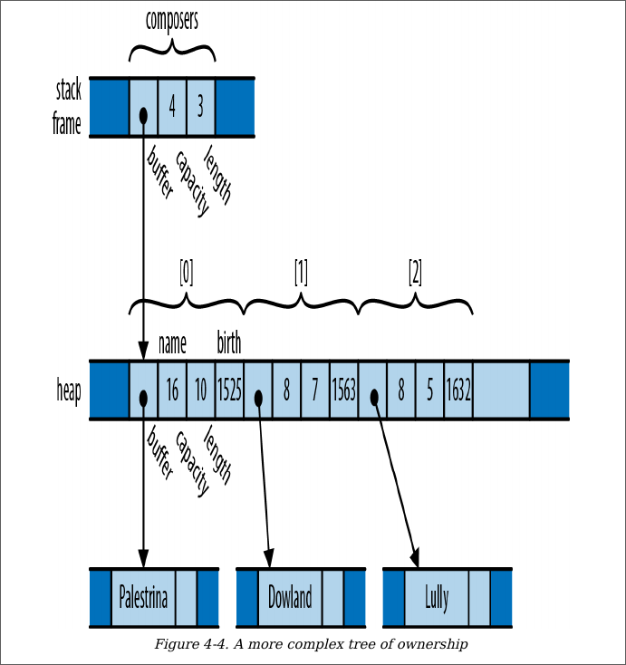
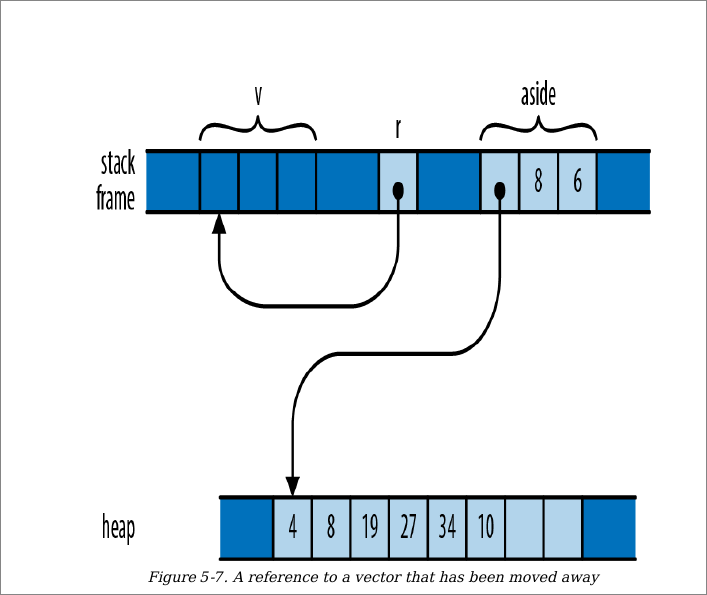

At this point, take a step back and consider the
consequences of the ownership relations we’ve presented
so far. Every value has a single owner, making it easy to
decide when to drop it. But a single value may own many
other values: for example, the vector composers owns all of
its elements. And those values may own other values in
turn: each element of composers owns a string, which owns
its text.
It follows that the owners and their owned values form
trees

And at the ultimate root of each tree is a
variable; when that variable goes out of scope, the entire
tree goes with it.



```
fn main() {
    let v = vec!["harshit".to_string(), "garv".to_string()];
    let r = &v;
    let aside = v;
    println!("{}", r[0]); //* this would be a dangling ref */
}


```
